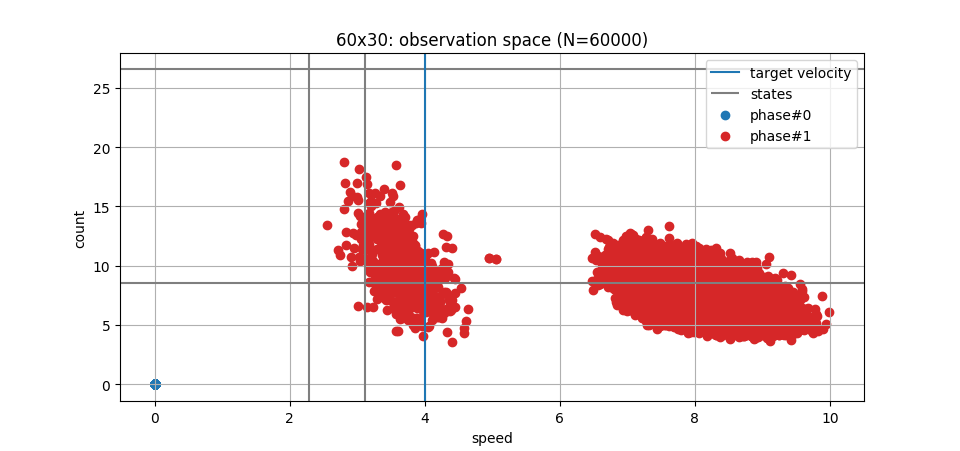

# GOAL

Show convergency wrt Q-tables in intersection scenario.

# MDP
	
- states: (s0, c0, s1, c1)
- actions: (0, 1)
- reward: -max((s*, s*) - (s0, s1), 0) * (c0, c1)
- P: null
- gamma: 0.99

 Where 
 
- sP -> [0, 22) average speed on phase P P=1,2
- cP -> [0, 18] average count on phase P P=1,2 
- s* target velocity

# Experiment

Experiments are carried out by running the following incantations

```
> time python models/train.py intersection -t 450000 -s 1 -i 1 -r 0 -e 0 -p 1 -W 0 -S 30 -L 60
```

## Settings

- Network: intersection.
- InFlows: `lane`.
- Edges Distribution: ['-238059328', '309265401']
- Phase Splits: 60x30 sec.
- Instances: 6.
- Time Steps: 450000 sec.
- Reward: `target velocity`.
	 
## Observation
 
- Departures only from phase 1.
- Fixed departure times.
- Fixed departure velocities.

## Learning
	
- Algorithm: Q-Learning.
- Upper confidence interval.
- c = 10.
- alpha = 5%.

## Discretization

A discretization scheme is needed by the choice of state value function estimation.

- sP <= 2.28 		-> 0
- 2.28 < sP < 3.11	-> 1
- sP >= 3.11		-> 2
- cP <= 2.28 		-> 0
- 2.28 < cP < 3.11	-> 1
- cP >= 3.11		-> 2

# Results

The states which are visited are:
```
(0, 0, 2, 1), (0, 0, 2, 0), (0, 0, 1, 1)
```

## Distance
	We measure two distances one in wrt Q-tables and another to the generated deterministic policies. The results can be generated by issuing:

```
> python analysis/q.py 
```


### Q-table

The distance is computed as the sum of the absolute L1 (manhattan) distances from each state action pair of experiments. Divided by the geometric meanfrom action value functions:

```
d, Qi, Qj = 0
for s in states:
	for a in actions
		d += |qi(s, a) - qj(s, a)|
		Qi += qi(s, a)
		Qj += qj(s, a)

return d / sqrt(Qi * Qj)
```


| 1 | 2  | 3  | 4  | 5  | 6  |
|:-:|:--:|:--:|:--:|:--:|:--:|
|0. |0.27|0.26|0.17|0.31|0.18|
|0. |0.  |0.26|0.21|0.26|0.21|
|0. |0.  |0.  |0.13|0.09|0.14|
|0. |0.  |0.  |0.  |0.14|0.13|
|0. |0.  |0.  |0.  |0.  |0.23|
|0. |0.  |0.  |0.  |0.  |0.  |

### Policy distance

From the Q-tables we generate deterministic policies by making a hard max from each state. We perform the jaccard distance as 1 - jaccard simetry as a measurement of policy a and policy b disagreement. Jaccard similarity can be measured by doing S and T sets, JS = |S and T| / |S or T| 


| 1 | 2 | 3 | 4 | 5 | 6 |
|:-:|:-:|:-:|:-:|:-:|:-:|
|0. |0. |0. |0. |0. |0. |
|0. |0. |0. |0. |0. |0. |
|0. |0. |0. |0. |0. |0. |
|0. |0. |0. |0. |0. |0. |
|0. |0. |0. |0. |0. |0. |
|0. |0. |0. |0. |0. |0. |

## Scatter

The figure shows the observation spaces perceived by the agent.
	 
	- phase#0 blue dots relate to the pairs (s0, c0).
	- phase#1 red dots relate to the pairs (s1, c1).
	- target velocity on purple.
	- gray lines are state separators;
	- all blue points are on state (0, 0, 0, 0)
	- left cluster: states (2, 0, 0, 0), (2, 1, 0, 0)
	- every point on left cluster has penalty 0.



## Research Questions 

	- Are distances small enought to affirm convergence?
	- Are distances due variability over exploration choices coupled with number of departures and departure velocities?
	

## Next steps

	- Verify proportion of optimal actions taken over cycles.
	- Update rewards computation.
	- Convert distances into policies. ok
	

