# Experiment 0x04

The goal is to show convergency wrt Q-tables in intersection scenario.

# MDP
	
- states: (s0, c0, s1, c1)
- actions: (0, 1)
- reward: -max((s\*, s\*) - (s0, s1), 0) \* (c0, c1)
- transition_matrix: null
- gamma: 0.99

 Where 
 
- sP -> [0, 22) average speed on phase P P=0, 1
- cP -> [0, 18] average count on phase P P=0, 1
- s\* -> 10 target velocity

# Experiment

Experiments are carried out by running the following incantations

```
> time python models/train.py intersection -t 180000 \
			-s 1 -i 1 -r 0 -e 0 -p 1 -W 0 -S 30 -L 60
```

## Settings

- Network: intersection.
- InFlows: `lane`.
- Edges Distribution: ['-238059328', '309265401', '383432312', '309265401']
- Phase Splits: 60x30, 54x36, 50x40, 45x45 sec.
- Instances: 12.
- Time Steps: 180000 sec. or 2000 cycles.
- Reward: `target velocity`.

	 
## Observation
 
- Departures from every phase.
- Uniform departure times.
- Uniform departure velocities.

## Learning
	
- Algorithm: Q-Learning.
- Upper confidence interval.
- c = 10.
- alpha = 50%.

## Discretization

A discretization scheme is needed by the choice of state value function estimation.

- sP <= 2.28 		-> 0
- 2.28 < sP < 3.11	-> 1
- sP >= 3.11		-> 2
- cP <= 8.56 		-> 0
- 26.58 < cP < 26.58	-> 1
- cP >= 26.58		-> 2

## Changes

- **alpha = 50%**
- **target velocity = 10**
- More instances from 6 to 12
- More phase splits: 60x30, 54x36, 50x40, 45x45 from 60x30
- cycles: 2000 from 5000

# Findings

The Rollouts figure was generated by running:

```
 python models/evaluate1.py data/experiments/0x04/4545/intersection_20200303-1506311583247991.7286332.pickle    -c 100 -r 12 -p 7 -s 100 -l 500
```
 ```
 python analysis/evaluation1.py data/experiments/0x04/4545/intersection_20200303-1506311583247991.7286332.l.eval.info.json
```

```
> python analysis/rewards.py cycles -t evaluate
```

The other figures are generated by running:

```
> python analysis/rewards.py cycles -t evaluate
```

##  Rollouts 60x30

The following figure is computed by the following procedure:

- Using Q-tables from one experiment saved at every 100 cycles.
- Separate tables saved at cycles 0, 100, 200, 300, 400, 500.
- For each Q-table do: 
- Make 12 rollouts of 500 cycles each observe the rewards.
- Perform mean and standard deviations from rewards.
- Repeat until done

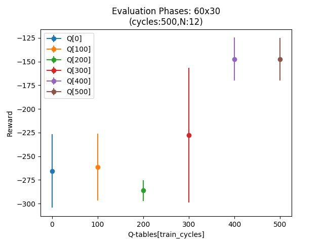


## Speeds and Counts 60x30

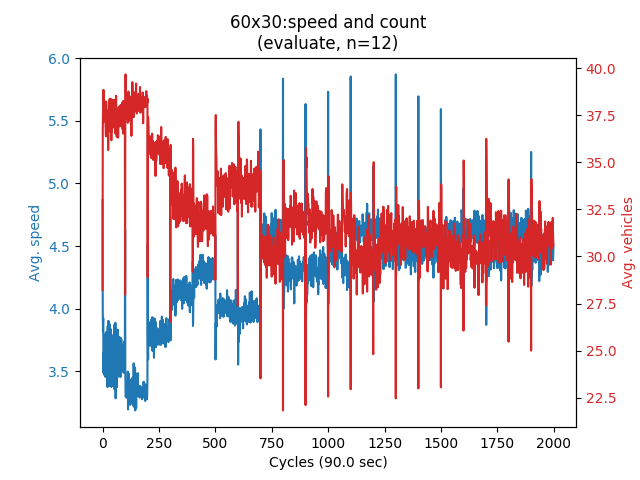

##  Optimal 60x30

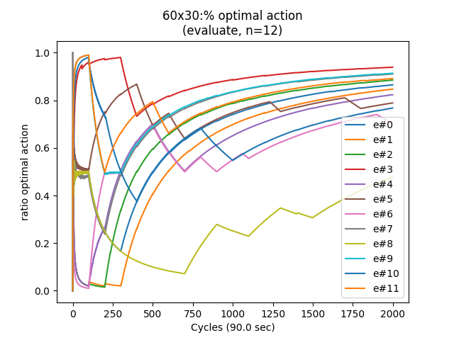

## Scatter 60x30

The scatter plot is generated by running:

```
> python analysis/scatter.py
```

The figure shows the observation spaces perceived by the agent.
	 
- phase#0 blue dots relate to the pairs (s0, c0).
- phase#1 red dots relate to the pairs (s1, c1).
- target velocity on purple.
- gray lines are state separators;

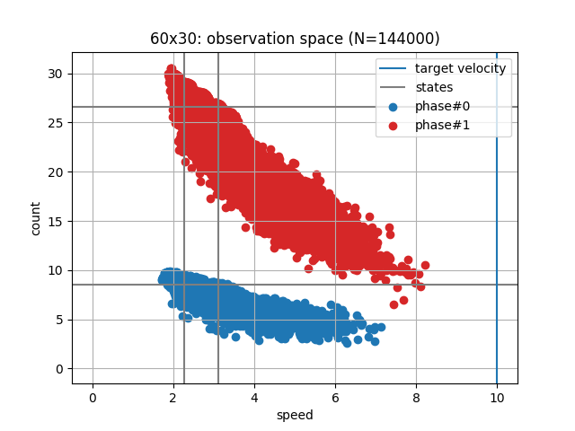

##  Rollouts 54x36

The following figure is computed by the following procedure:

- Using Q-tables from one experiment saved at every 100 cycles.
- Separate tables saved at cycles 0, 100, 200, 300, 400, 500.
- For each Q-table do: 
- Make 12 rollouts of 100 cycles each observe the rewards.
- Perform mean and standard deviations for each
- Repeat until done

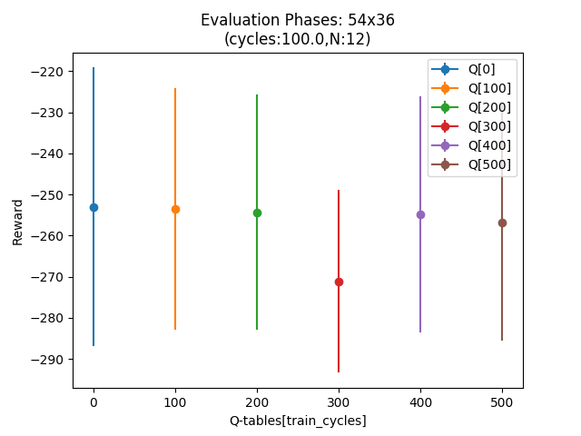

## Speeds and Counts 54x36

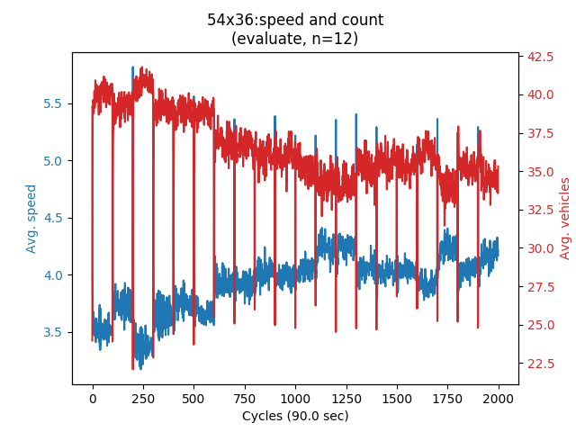

##  Optimal 54x36

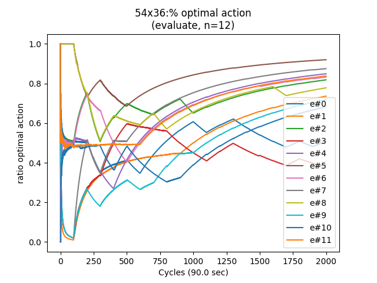

## Scatter 54x36

The scatter plot is generated by running:

```
> python analysis/scatter.py
```

The figure shows the observation spaces perceived by the agent.
	 
- phase#0 blue dots relate to the pairs (s0, c0).
- phase#1 red dots relate to the pairs (s1, c1).
- target velocity on purple.
- gray lines are state separators;


##  Rollouts 50x40

The following figure is computed by the following procedure:

- Using Q-tables from one experiment saved at every 100 cycles.
- Separate tables saved at cycles 0, 100, 200, 300, 400, 500.
- For each Q-table do: 
- Make 12 rollouts of 100 cycles each observe the rewards.
- Perform mean and standard deviations.
- Repeat until done

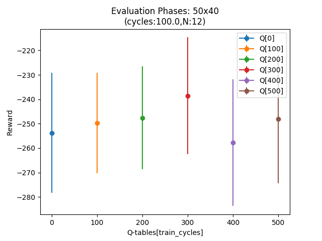

## Speeds and Counts 50x40

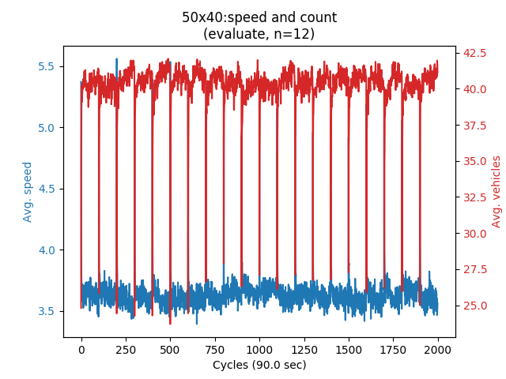

##  Optimal 50x40

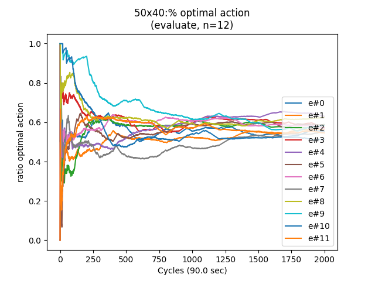

## Scatter 50x40

The scatter plot is generated by running:

```
> python analysis/scatter.py
```

The figure shows the observation spaces perceived by the agent.
	 
- phase#0 blue dots relate to the pairs (s0, c0).
- phase#1 red dots relate to the pairs (s1, c1).
- target velocity on purple.
- gray lines are state separators;

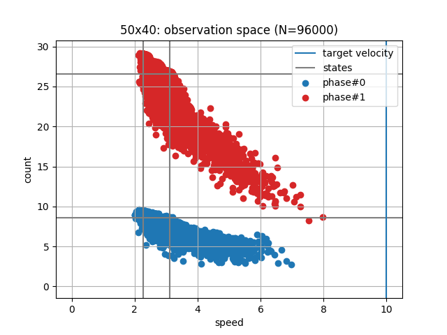


##  Rollouts 45x45

The following figure is computed by the following procedure:

- Using Q-tables from one experiment saved at every 100 cycles.
- Separate tables saved at cycles 0, 100, 200, 300, 400, 500.
- For each Q-table do: 
- Make 12 rollouts of 100 cycles each observe the rewards.
- Perform mean and standard deviations.
- Repeat until done

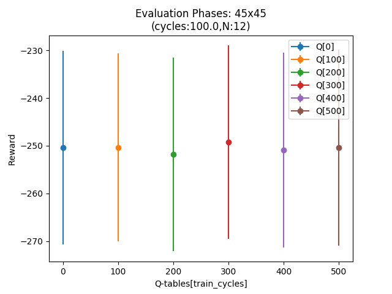

## Speeds and Counts 45x45

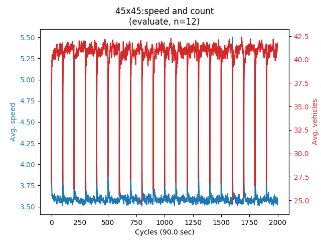

##  Optimal 45x45

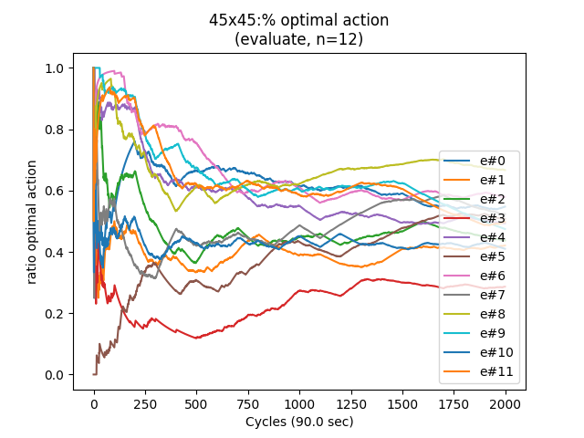

## Scatter 45x45

The scatter plot is generated by running:

```
> python analysis/scatter.py
```

The figure shows the observation spaces perceived by the agent.
	 
- phase#0 blue dots relate to the pairs (s0, c0).
- phase#1 red dots relate to the pairs (s1, c1).
- target velocity on purple.
- gray lines are state separators;

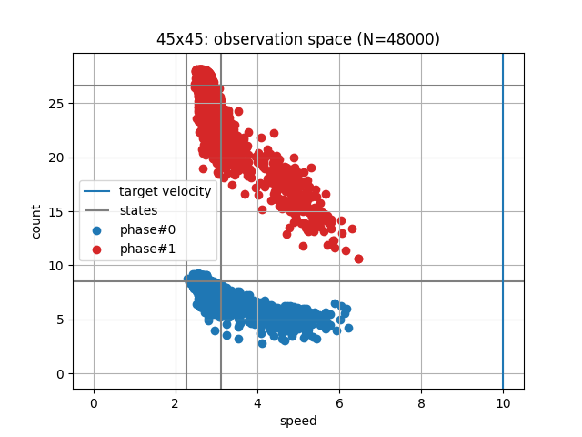


